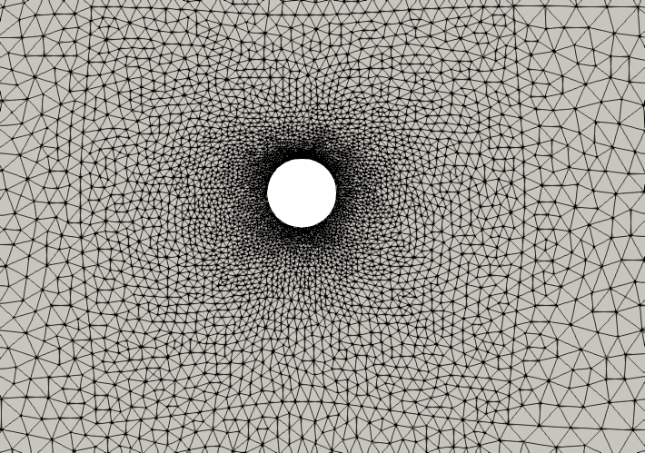
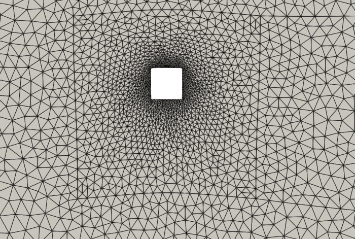

# CFD & FSI with FreeFEM

This repository contains CFD and FSI solvers based on **FEM**. These solvers are intended for educational purposes but can also be adapted for researchers if you are interested. Animations are available on my [YouTube channel](https://www.youtube.com/playlist?list=PL9IBrbGcgPbKwmbFIOkLtS9H096AkjX53).

These solvers are based on the opensource library [**FreeFEM**](https://freefem.org/). To run these scripts, you do not need a knowledge of the FreeFEM library.

Please report any bugs, and contact me if you want to adapt these further.


## Instructions for running the code

```
FreeFem++  <script-file>
```

Before running the FreeFEM executable, set ```OMP_NUM_THREADS=1``` by exceuting 
```
export OMP_NUM_THREADS=1
```
so that the FreeFEM executable does not use all of the processors on your computer.

## Post-processing
The solver generates the results (fluid velocity and pressure) in the VTU format which can be opened and processed in [ParaView](https://www.paraview.org/).

The solver also generates a ```.dat``` file with force and displacement data at each time step.

## Some samples

### Circular cylinder


### Square


## References
* Kadapa, C., Dettmer, W. G., and Peri\'c, D. *Accurate iteration-free mixed-stabilised formulation for laminar incompressible Navier–Stokes: Applications to fluid–structure interaction*, Journal of Fluids and Structures, 103077, 2020.

* Kadapa, C., *A second-order accurate non-intrusive staggered scheme for the interaction of ultra-lightweight rigid bodies with fluid flow*, Ocean Engineering, 107940, 2020.
